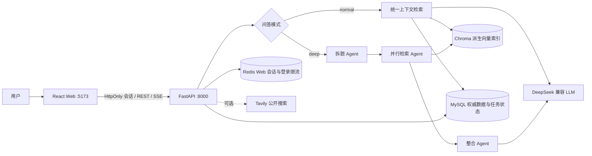

# AI 知识库问答系统

一个面向个人知识管理的 RAG 问答项目。用户可以上传文档、维护笔记，并通过普通问答或多 Agent 深度研究获得带来源的流式回答。

项目当前定位为本地或可信内网中的单用户系统，重点处理了流式问答一致性、索引失败恢复、数据库迁移、资源归属校验和低敏感可观测性。它不是完整的多租户 SaaS，不应未经额外保护直接暴露到公网。

## 功能概览

- **文档知识库**：支持 PDF、DOCX、TXT、Markdown、HTML，按内容哈希去重并通过持久化任务维护 Chroma 索引。
- **语义笔记**：支持笔记 CRUD、版本冲突检测和向量索引同步。
- **普通问答**：并行检索文档、笔记、情景记忆和会话上下文，使用 SSE 增量返回回答与来源。
- **深度研究**：通过 LangGraph 完成结构化拆题、并行检索和答案整合。
- **可选联网搜索**：仅把当前公开问题交给隔离规划器；最终回答模型不持有搜索工具权限。
- **持久化会话**：MySQL 保存完整消息、摘要、来源和问答执行状态，刷新页面或重启服务后可以恢复。
- **失败恢复**：文档和笔记索引由 MySQL 持久化任务驱动，支持租约、幂等执行、指数退避和失败重试。
- **本地 Web 工作区**：React + TypeScript 提供问答、会话、文档和笔记管理界面。

## 系统架构



### 数据职责

| 组件 | 职责 |
| --- | --- |
| MySQL | 用户、会话、完整聊天记录、摘要、来源、文档、笔记、情景记忆、问答状态和索引任务的权威数据源 |
| ChromaDB | 文档与笔记的可重建向量索引；检索结果必须通过 MySQL 状态和版本校验 |
| Redis | React Web 的 HttpOnly 登录会话和登录限流；不保存权威对话内容 |
| 本地文件系统 | 保存上传原文件；文件状态由 MySQL 文档记录管理 |

### Chat 执行流程

```text
认证和资源归属校验
  -> 预占 client_turn_id 并获取有期限的执行租约
  -> 从 MySQL 读取已完成历史和摘要
  -> 并行检索上下文
  -> normal 或 deep 流式生成，并定期续租
  -> 单事务写入 user、assistant、sources 和 completed turn
  -> best-effort 更新摘要与情景记忆
  -> 返回 sources 和 done 事件
```

`client_turn_id` 是一次问答的幂等键。连接中断后，客户端可以使用同一 ID 查询状态或重试；已经完成的回答会直接重放。租约过期后其他 worker 可以接管任务，旧 owner 不能覆盖新执行结果。

### 索引任务流程

文档或笔记变更时，业务记录与 `index_jobs` 任务在同一数据库事务中提交。任务使用稳定向量 ID 和索引版本执行 upsert/delete；进程退出、Chroma 暂时不可用或 embedding 失败时，后台补偿循环会继续处理未完成任务。

文档状态包括 `indexing`、`ready`、`failed` 和 `deleting`。只有与 MySQL 当前版本一致且状态为 `ready` 的文档可以进入检索；重复上传失败文档会触发手动重试。

## 技术栈

| 领域 | 技术 |
| --- | --- |
| 后端 | Python 3.11、FastAPI、SQLAlchemy、SSE |
| 前端 | React 19、TypeScript、Vite |
| LLM / Agent | DeepSeek 兼容 API、LangChain、LangGraph |
| RAG | ChromaDB、`BAAI/bge-small-zh-v1.5`、sentence-transformers |
| 文档解析 | PyMuPDF、docx2txt、标准库 HTMLParser |
| 数据设施 | MySQL 8、Redis、Alembic |
| 测试与 CI | pytest、Vitest、GitHub Actions、MySQL 8.4 CI service |

## 快速开始

### 1. 环境要求

- Python 3.11+
- Node.js 22+
- MySQL 8.x
- Redis 6.x+

### 2. 安装依赖

```powershell
git clone <你的仓库地址>
cd ai-knowledge-qa

python -m venv venv
.\venv\Scripts\Activate.ps1
python -m pip install -r requirements.txt

cd web
npm install
cd ..
```

Linux/macOS 使用 `source venv/bin/activate` 激活虚拟环境。

### 3. 配置环境变量

复制 `.env.example` 为 `.env`，然后填写真实配置。不要提交 `.env`。

```powershell
Copy-Item .env.example .env
```

最小必填项：

```dotenv
DEEPSEEK_API_KEY=sk-your-key
MYSQL_USER=root
MYSQL_PASSWORD=your-password
MYSQL_DATABASE=ai_qa
APP_ACCESS_TOKEN=请替换为足够长的随机值
APP_USER_ID=default-user
```

可以使用 Python 生成访问 token：

```powershell
python -c "import secrets; print(secrets.token_urlsafe(32))"
```

主要配置项：

| 配置 | 默认值 | 说明 |
| --- | --- | --- |
| `LLM_MODEL` | `deepseek-v4-flash` | DeepSeek 兼容模型名 |
| `LLM_BASE_URL` | `https://api.deepseek.com` | OpenAI 兼容 API 地址 |
| `TAVILY_API_KEY` | 空 | 留空时禁用联网搜索 |
| `MYSQL_HOST` / `MYSQL_PORT` | `localhost` / `3306` | MySQL 地址 |
| `REDIS_HOST` / `REDIS_PORT` | `localhost` / `6379` | Web 会话与限流使用的 Redis 地址 |
| `APP_WEB_SESSION_TTL_SECONDS` | `604800` | 本地 Web 登录会话有效期 |
| `MAX_UPLOAD_BYTES` | `26214400` | 单个上传文件最大字节数，默认 25 MiB |
| `CHAT_STAGE_TIMEOUT_SECONDS` | `30` | 检索总超时或流式阶段无进度超时 |
| `CHAT_TURN_LEASE_SECONDS` | `90` | 问答执行租约时间 |
| `CHAT_TURN_HEARTBEAT_SECONDS` | `30` | 问答租约续期周期；租约必须至少是它的 3 倍 |
| `INDEX_JOB_POLL_SECONDS` | `5` | 索引补偿任务轮询周期 |
| `INDEX_JOB_LEASE_SECONDS` | `120` | 单个索引任务租约时间 |
| `INDEX_JOB_MAX_ATTEMPTS` | `10` | 自动索引最大尝试次数 |
| `INDEX_JOB_RETRY_BASE_SECONDS` | `30` | 索引退避起始时间 |
| `INDEX_JOB_RETRY_MAX_SECONDS` | `1800` | 索引退避上限 |
| `SUMMARY_LLM_TIMEOUT_SECONDS` | `30` | 摘要模型超时 |
| `SUMMARY_LLM_MAX_RETRIES` | `0` | 摘要模型 SDK 自动重试次数 |
| `LLM_CONTEXT_MAX_CHARS` | `100000` | 注入模型的动态资料字符预算 |
| `RAG_RELEVANCE_THRESHOLD` | `0.5` | 文档与笔记检索相关度阈值 |
| `CHROMA_PERSIST_DIR` | `./data/chroma_db` | Chroma 持久化目录 |
| `UPLOAD_DIR` | `./data/uploads` | 上传文件目录 |

这些超时、租约、批量和大小限制是单机部署的可调默认值。生产部署前应根据真实文件大小、索引耗时、失败率、任务积压和 LLM 成本重新校准。

### 4. 初始化或升级数据库

```powershell
python -m db.init_db --upgrade
alembic current
```

`db.init_db` 会安全补齐结构并通过 Alembic 升级到最新 revision。对于没有 Alembic 版本记录的旧数据库，只有在现有结构通过完整性检查后才会接管；残缺数据库不会被错误标记为最新。

以下命令会清空所有业务数据，只能用于明确需要重建的开发环境：

```powershell
python -m db.init_db --drop
```

### 5. 启动项目

Windows 可以直接双击 `start.bat`，或运行：

```powershell
.\start.bat
```

跨平台启动方式：

```bash
python launcher.py
```

启动器会同时管理 FastAPI 和 Vite，等待服务就绪后打开 `http://127.0.0.1:5173/app/`。它使用一次性 bootstrap token 换取 HttpOnly Cookie，长期 `APP_ACCESS_TOKEN` 不会写入浏览器 URL 或前端构建。

也可以在两个终端中分别启动：

```powershell
# 终端一
python -m app.main

# 终端二
cd web
npm run dev
```

常用地址：

- Web 工作区：`http://127.0.0.1:5173/app/`
- 后端健康检查：`http://127.0.0.1:8000/`
- OpenAPI 文档：`http://127.0.0.1:8000/docs`

执行 `npm run build` 后，FastAPI 会在检测到 `web/dist` 时把生产前端挂载到 `/app`。

## API 概览

除 Web 登录接口外，业务 API 需要以下任一认证方式：

- 服务端客户端：`Authorization: Bearer <APP_ACCESS_TOKEN>`
- React Web：本机登录流程签发的 HttpOnly Cookie

所有业务资源还会校验请求中的 `user_id` 是否等于服务端固定的 `APP_USER_ID`。

| 方法与路径 | 用途 |
| --- | --- |
| `POST /api/v1/sessions` | 创建会话 |
| `GET /api/v1/sessions` | 分页列出会话 |
| `DELETE /api/v1/sessions/{session_id}` | 删除会话及关联数据 |
| `POST /api/v1/documents` | 上传并索引文档 |
| `GET /api/v1/documents` | 分页列出文档与索引状态 |
| `DELETE /api/v1/documents/{document_id}` | 提交文档删除任务 |
| `POST /api/v1/notes` | 创建笔记 |
| `GET /api/v1/notes` | 分页读取完整笔记 |
| `GET /api/v1/notes/summaries` | 分页读取笔记摘要 |
| `GET /api/v1/notes/{note_id}` | 读取单篇笔记 |
| `PUT /api/v1/notes/{note_id}` | 按版本更新笔记 |
| `DELETE /api/v1/notes/{note_id}` | 提交笔记删除任务 |
| `POST /api/v1/chat` | normal/deep SSE 流式问答 |
| `GET /api/v1/chat/turn` | 查询幂等问答状态或获取完成结果 |
| `GET /api/v1/chat/history` | 分页读取已持久化消息 |

列表接口统一支持 `limit` 和 `offset`，其中 `limit` 范围为 1～100。

Chat SSE 事件包括：

- `status`：deep 模式阶段状态或工具状态
- `token`：回答增量文本
- `sources`：规范化后的来源列表
- `done`：本轮完成
- `error`：本轮失败

## 测试与质量检查

后端：

```powershell
python -m pytest -q
python -m pip check
python -m compileall -q app agents db evaluation indexing memory migrations rag tools tests
python evaluation/run_eval.py --top-k 2 --output evaluation/results/local.json
```

离线评测使用 `deterministic-char-bigram-v1` 确定性字符 bigram 检索器，仅验证公开小样本、指标实现和 CI 可复现性，不替代线上 BGE 向量检索，也不代表生产数据分布。

前端：

```powershell
cd web
npm test -- --run
npm run lint
npm run build
```

当前修复分支最近一次本地回归结果：

| 检查 | 结果 |
| --- | --- |
| pytest | 223 passed |
| Vitest | 60 passed |
| TypeScript + Vite 生产构建 | 通过 |
| Python compileall | 通过 |
| pip check | No broken requirements found |

需要运行中的 MySQL、Redis、后端和有效 LLM 配置时，可以执行：

```powershell
cd web
npm run test:e2e:chat
npm run test:e2e:documents
```

GitHub Actions 会在 push、pull request 和手动触发时：

1. 安装固定版本的 Python 依赖并执行 `pip check`；
2. 启动 MySQL 8.4 service，执行数据库升级并确认 Alembic revision；
3. 编译 Python 源码、运行全部 pytest 和离线 RAG 基线；
4. 使用 `npm ci` 安装前端依赖，运行 Vitest 和生产构建。

CI 不调用付费 LLM，也不需要真实 API 密钥。Redis 和浏览器 E2E 不在常规 CI 中启动。

## 可观测性与隐私

每个 HTTP 请求返回 `X-Request-ID`，Chat 使用独立 `turn_id` 串联执行过程。主要结构化事件包括：

- `request_completed`
- `turn_started`
- `turn_retrieval_completed`
- `turn_first_token`
- `turn_completed`
- `turn_failed`
- `turn_cancelled`
- `turn_stage_failed`

日志只应记录关联 ID、路由模板、状态码、模式、阶段、数量、耗时和错误类型。日志辅助函数会拒绝 `content`、`question`、`prompt`、`token`、`authorization` 等敏感字段名。

## 项目结构

```text
agents/       LangGraph 拆题、检索和整合工作流
app/          FastAPI 路由、认证、SSE、错误处理和可观测性
db/           SQLAlchemy 模型、数据库连接、结构检查和初始化入口
migrations/   Alembic 可逆迁移脚本
indexing/     MySQL 持久化索引任务、租约、重试和补偿执行器
memory/       会话摘要、情景记忆、语义笔记和统一上下文检索
rag/          文档加载、分块、向量库、上下文预算和 LLM 封装
tools/        隔离的联网规划和 Tavily 结构化搜索
evaluation/   公开小样本、离线评测 CLI 和基线结果
tests/        后端自动化测试
web/          React 工作区、组件测试和浏览器 E2E 脚本
```

## 当前边界

- 当前采用固定 `APP_USER_ID`，没有注册、密码、角色、刷新 token 或完整多租户认证与隔离。
- Chroma 的用户隔离依赖 metadata filter，不是物理分库；MySQL 回查负责最终权威校验。
- Redis 不可用时 React Web 登录会失败，但 MySQL 中的会话、消息和摘要不会丢失。
- 尚未实现恶意文件扫描、内容沙箱、生产级指标后端、告警、自动备份恢复演练和容量验证。
- FastAPI 与 Vite 默认只监听 `127.0.0.1`。公网部署前必须增加 HTTPS、正式身份认证、限流、网络访问控制和独立的生产进程管理。
- 离线 RAG 基线验证的是确定性公开小样本与指标实现，不等同于真实数据分布下的线上 LLM 质量。

## 数据库迁移与恢复原则

- MySQL 是权威事实来源；Chroma、摘要和索引任务状态都可以根据权威记录恢复或重建。
- 升级前应备份 MySQL 和上传目录，先停止写入服务，再执行 `python -m db.init_db --upgrade`。
- 不要通过手工修改 `alembic_version` 跳过结构检查。
- 不要把 `python -m db.init_db --drop` 用于包含有效数据的环境。
