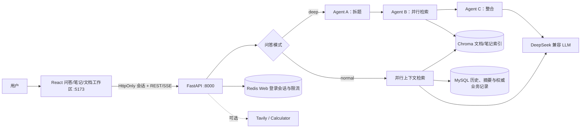

# AI 知识库问答系统

一个面向个人知识管理的 RAG + 多 Agent 问答项目。系统支持上传文档、普通流式问答和深度研究，并围绕数据一致性、单用户安全边界、失败恢复、低敏感可观测性和可复现实验补齐了工程化证据。

> 项目定位：本地或可信内网中的单用户演示系统，不是完整多租户 SaaS，也不应未经额外保护直接暴露到公网。

## 项目亮点

- **双模式问答**：normal 模式并行检索四类上下文；deep 模式通过 LangGraph 完成拆题、并行检索和结构化整合。
- **三层记忆**：MySQL 持久化会话历史/摘要与情景记忆，MySQL + Chroma 管理语义记忆；Redis 不再承载对话事实。
- **一致性恢复**：客户端 turn ID + MySQL 状态机支持失败重试和完成结果重放；user/assistant/来源一次事务提交，不会留下半轮消息。
- **安全边界**：业务 API 使用 Bearer token，后端固定单一 `APP_USER_ID`；上传有流式大小限制，文档删除失败保留可重试的权威记录。
- **可观测性**：request/turn ID 串联检索、首 token、完成和失败阶段；日志只记录 ID、计数、耗时、模式与错误类型。
- **可验证交付**：Python 与 React 自动化测试、真实本地 MySQL/Redis 联调、无密钥 GitHub Actions 和公开离线评测基线。

## 架构



### Chat 状态流

```text
Bearer / HttpOnly 会话认证与资源归属校验
  -> 预占 client_turn_id，并取得带过期时间的执行租约
  -> 从 MySQL 摘要与历史读取此前已完成的对话上下文
  -> 并行检索文档、笔记与情景记忆
  -> normal/deep 流式生成，独立短事务定期续租
  -> 单事务持久化 user + assistant + sources + completed turn
  -> best-effort 更新 MySQL 摘要与情景事件
  -> sources + done
```

生成未完成时只把 reservation 标为 failed，不写聊天事实；进程异常退出后，其他 worker 只能接管已过期租约，并且旧 owner 无权再提交结果。assistant 已持久化后，即使浏览器没收到 `done`，同一 turn ID 重试也会直接重放结果。React 重新打开会话时按 session ID 从 MySQL 加载历史，因此第二天启动或 Redis 旧缓存过期后仍可继续同一会话。

会话摘要是可重建的派生状态：后台摘要调用默认 30 秒超时、0 次 SDK 重试；失败时不会截断原始消息或推进压缩游标，下一次达到压缩条件时可继续尝试。

### 文档生命周期

上传按块读取并增量计算 SHA-256，超过 `MAX_UPLOAD_BYTES` 时在解析和 embedding 前返回 413。临时文件通过原子改名进入正式目录；解析、向量化或重复校验失败不会留下新数据库记录。删除时先处理 Chroma 派生索引，失败则保留 MySQL 权威记录与源文件以便重试。

## 技术栈

| 领域 | 技术 |
| --- | --- |
| API / UI | FastAPI、SSE、React、TypeScript、Vite、httpx |
| LLM / Agent | DeepSeek 兼容 API、LangChain、LangGraph |
| RAG | ChromaDB、`BAAI/bge-small-zh-v1.5`、PyMuPDF、docx2txt |
| 数据 | MySQL、Redis、SQLAlchemy |
| 工程质量 | pytest、GitHub Actions、结构化事件日志、离线评测 CLI |

## 快速开始

### 1. 环境要求

- Python 3.11+
- Node.js 22+（独立 Web 工作区）
- MySQL 8.x
- Redis 6.x+

```bash
git clone <你的仓库地址>
cd ai-knowledge-qa
python -m venv venv

# Windows PowerShell
.\venv\Scripts\Activate.ps1
# Linux/macOS
# source venv/bin/activate

python -m pip install -r requirements.txt
cd web && npm install && cd ..
```

### 2. 配置

复制 `.env.example` 为 `.env`，不要提交真实配置：

```bash
cp .env.example .env
```

| 变量 | 必填 | 用途 |
| --- | --- | --- |
| `DEEPSEEK_API_KEY` | 是 | LLM API 凭据 |
| `MYSQL_*` | 是 | MySQL 连接配置 |
| `APP_ACCESS_TOKEN` | 是 | 服务端 API 的 Bearer token，也可在本机手动换取 Web 会话；应使用足够长的随机值 |
| `APP_USER_ID` | 是 | 服务端允许访问的固定单用户 ID |
| `REDIS_*` | 否 | Redis 连接配置，密码可留空；当前用于 Web 登录会话与登录限流，不保存权威对话记忆 |
| `TAVILY_API_KEY` | 否 | 非空时允许 normal Agent 使用联网搜索 |
| `API_HOST` | 否 | FastAPI 监听地址，默认 `127.0.0.1` |
| `MAX_UPLOAD_BYTES` | 否 | 默认 25 MiB，是当前单机演示的可调整启发式值 |
| `CHAT_TURN_LEASE_SECONDS` / `CHAT_TURN_HEARTBEAT_SECONDS` | 否 | 默认 90 / 30 秒；租约至少覆盖 3 个心跳周期，用于多 worker 的过期接管与 fencing |
| `SUMMARY_LLM_TIMEOUT_SECONDS` / `SUMMARY_LLM_MAX_RETRIES` | 否 | 内部摘要默认 30 秒超时、0 次自动重试；不改变普通问答模型调用参数 |

可用以下命令生成 token：

```bash
python -c "import secrets; print(secrets.token_urlsafe(32))"
```

### 3. 初始化与启动

```powershell
python -m db.init_db

# Windows：双击 start.bat，或在终端执行
.\start.bat
```

升级已有数据库时，先停止服务并执行 `python -m db.init_db --upgrade`。该命令只添加当前版本缺失的表、列、索引和外键并保留权威业务数据；若异常旧库里已有不属于任何用户或会话的孤儿 ChatTurn reservation，会先清除这类不可恢复的派生状态。应用启动时会校验 schema 版本及上述必需结构，结构过旧时会拒绝启动并给出升级命令。`--drop` 仍仅用于明确需要清空全部数据的重建场景。

`start.bat` 会优先使用项目的 `venv`，并行拉起 FastAPI 和 React Web 工作区，等待服务健康检查通过后自动打开 `http://127.0.0.1:5173/app/`。启动器使用一次性凭证换取 HttpOnly Cookie，长期 `APP_ACCESS_TOKEN` 不会打包进浏览器。按 `Ctrl+C` 会一起关闭两个服务；若端口已被旧进程占用会明确报错。跨平台环境可以直接运行同一启动器：

```bash
python launcher.py
```

也可以在两个终端中分别启动，便于单独调试：

```bash

# 终端一：后端
python -m app.main

# 终端二：React 工作区
cd web
npm run dev
```

问答、笔记和文档管理均位于 `http://127.0.0.1:5173/app/`。健康检查位于 `http://127.0.0.1:8000/`；服务端客户端使用 Bearer token，浏览器工作区使用仅本机签发的 HttpOnly 会话。后端启动时会幂等创建 `APP_USER_ID` 对应的固定用户，新数据库无需先访问某个前端页面来完成用户初始化。

## 验证与实测证据

### 自动化测试

```bash
python -m pytest -q
python -m pip check
python -m compileall -q app agents db evaluation memory rag tools
cd web
npm test -- --run
npm run lint
npm run build
```

2026-07-29 在 Python 3.11、Node.js 24 和 Edge 本地环境的结果：

| 检查 | 实际结果 |
| --- | --- |
| pytest | 194 passed；覆盖持久化会话摘要、幂等 turn、租约接管与 fencing、原子消息对、schema 增量升级与启动恢复 |
| React 前端 | 55 passed；覆盖笔记离开前保存、会话历史恢复、失败重试、重复发送防护、并发会话删除、文档上传/删除、normal/deep、SSE 任意分块和安全 Markdown；TypeScript 检查和 Vite 生产构建通过并纳入 CI |
| Edge 笔记切换 | 9 篇真实笔记：未缓存切换 70 ms，缓存切换 19 ms；控制台 0 error |
| Edge React 问答 | 真实 normal/deep SSE 流程完成；桌面与 390 px 移动布局通过；控制台 0 error/warning，浏览器存储与 URL 无凭证 |
| Edge React 文档 | 真实上传、索引和删除闭环完成并自动清理；1440/768/320 px 无横向溢出，控制台 0 error/warning，浏览器存储与 URL 无凭证 |
| 后端模块导入 | 优化前单次冷导入约 20.97 秒；惰性加载后，三次独立进程实测 1.515–1.548 秒 |
| pip check | No broken requirements found |
| 本地服务联调 | 根路径 200；带正确 token 的空测试用户会话查询 200；Redis PING 成功 |
| 故障路径 | 覆盖 LLM/网络中断、幂等重试与结果重放、Redis 不参与问答、超限上传、Chroma 删除失败、跨用户访问和摘要会话删除 |

仓库提供 `npm run test:e2e:chat` 做真实 normal/deep 问答与自动清理，`npm run test:e2e:documents` 做真实文档上传、响应式检查和自动删除，`npm run test:e2e:chat -- --visual-only` 可复用既有会话做无 LLM 成本的桌面/移动视觉检查。正式演示前仍建议在目标机器手动走一遍上传、问答、切换与删除流程。

### 无密钥 RAG 离线评测

```bash
python evaluation/run_eval.py --top-k 2 --output evaluation/results/local.json
```

已提交的实际结果见 [`evaluation/results/lexical_baseline.json`](evaluation/results/lexical_baseline.json)：

| 数据集 / 检索器 | 样本 | Recall@2 | 来源覆盖@2 | 引用完整性 |
| --- | ---: | ---: | ---: | ---: |
| `aiqa-public-mini-v1` / `deterministic-char-bigram-v1` | 4 文档 / 4 问题 | 1.00 | 1.00 | 1.00 |

指标定义：

- **Recall@K**：前 K 个结果至少命中一个期望来源的问题比例。
- **来源覆盖@K**：被前 K 个结果找回的期望来源数 / 全部期望来源数。
- **引用完整性**：固定参考答案中实际引用的期望来源数 / 全部期望来源数。

这些结果只验证公开合成小样本、指标实现与确定性轻量检索基线，**不代表生产数据分布**；默认评测器不是线上使用的 BGE embedding，引用完整性也不评估实时 LLM 生成质量。结果记录数据集 SHA-256、检索器版本、运行时间和逐题分数，便于复核而不是夸大模型效果。

### CI

`.github/workflows/test.yml` 在 push、pull request 和手动触发时执行依赖安装、`pip check`、源码编译、全量测试和离线评测。CI 使用明确的占位环境变量，不读取仓库 secret，也不调用 MySQL、Redis 或付费 LLM。

工作流采用官方 `actions/checkout@v6` 与 `actions/setup-python@v6`，核对日期为 2026-07-27。

## 可观测性与隐私

每个 HTTP 请求返回 `X-Request-ID`。Chat turn 使用独立 `turn_id`，主要事件包括：

- `request_completed`
- `turn_started`
- `turn_retrieval_completed`
- `turn_first_token`
- `turn_completed` / `turn_failed` / `turn_cancelled`
- `turn_stage_failed`（已完成回答的派生状态降级）

事件消息为 JSON，只允许记录关联 ID、route 模板、状态码、模式、阶段、计数、耗时和错误类型。日志辅助函数会拒绝 `content`、`question`、`prompt`、`token`、`authorization` 等敏感字段名；不要在其他日志中自行输出请求体或完整异常上游响应。

## 安全边界与已知限制

- Bearer token + 固定 `APP_USER_ID` 是单用户演示边界，不是注册、密码、角色、刷新 token 或完整多租户认证。
- Web 会话只解决本机单用户演示的浏览器凭证隔离，不是完整多租户认证；公网部署前应增加 HTTPS、正式身份认证、限流和网络访问控制。
- Redis 仍用于 React 的 HttpOnly 登录会话和登录限流；Redis 不可用时 Web 登录会返回 503，但 MySQL 中的会话、消息和摘要不会丢失，服务端 Bearer 客户端也不依赖 Redis 读取对话事实。
- ChatTurn 使用数据库时钟、每次执行独立 owner、90 秒租约与 30 秒心跳；多 worker 启动时只回收无租约或已过期的 turn，旧 worker 受 fencing 约束不能覆盖新 owner。90/30 是结合当前 30 秒流式空闲超时设定的启发式默认值，并非容量结论；生产部署应根据事件循环阻塞、数据库延迟和故障恢复指标重新校准。
- FastAPI 与 Vite 默认只监听 `127.0.0.1`；不要直接把开发服务端口暴露到公网。
- Chroma 的用户隔离依赖 metadata filter，而不是物理分库；当前后端再通过固定用户 ID 限制访问。
- 系统未实现恶意文件扫描、复杂内容沙箱、全链路指标后端、告警、自动备份恢复演练或生产级容量验证。
- 25 MiB 上传上限来自当前单机演示约束，部署前应以真实文档的解析耗时、峰值内存和 embedding 成本重新校准。

租约方案于 2026-07-29 对照了 MySQL 8.4 官方说明：`GET_LOCK()` 会在持有它的数据库会话结束时释放，而空闲连接又受 `wait_timeout` 管理，因此不再用长时间持有的命名锁代表应用实例存活；参考 [Locking Functions](https://dev.mysql.com/doc/refman/8.4/en/locking-functions.html) 与 [Server System Variables](https://dev.mysql.com/doc/refman/8.4/en/server-system-variables.html)。

## 适合简历的表述参考

> 设计并实现基于 React、FastAPI、LangGraph、Chroma、MySQL 与 Redis 的知识库问答系统，支持文档上传管理、normal/deep 双模式 SSE 流式回答、MySQL 持久化会话和笔记自动保存；以 client turn ID、原子消息事务和结果重放修复流式失败一致性，引入 HttpOnly 本机会话、流式上传限制和低敏感 turn 级可观测性，并以 Python/React 自动化测试、无密钥 CI 与可复现离线评测固化工程证据。

面试时建议重点解释三个取舍：为什么 MySQL 是权威数据源、为什么 Chroma 是可重建索引且 Redis 只承载临时 Web 会话、为什么公开评测基线不能等同于线上模型质量。

## 项目结构

```text
agents/       LangGraph 深度研究工作流
app/          FastAPI 路由、认证、错误处理、SSE 与可观测性
db/           SQLAlchemy 模型、连接与建表脚本
evaluation/   公开数据集、无密钥评测 CLI 和实际结果
memory/       短期、情景和语义记忆
rag/          Loader、Splitter、Chroma、Retriever 与 LLM 封装
tests/        自动化测试
tools/        Web Search 与 Calculator 工具
web/          React 问答、笔记与文档工作区、组件测试和 Edge E2E
```
