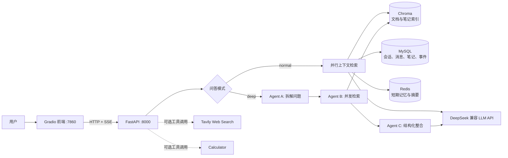

# AI 知识库问答系统

一个基于 RAG（检索增强生成）和多 Agent 工作流的个人知识库问答系统。用户可上传文档、保存笔记，并在普通问答或深度研究模式下获得带来源提示的流式回答。

> 当前版本定位为单用户 MVP，适合本地使用或单台 Linux 云服务器部署。它不包含用户认证、租户隔离、容器化、监控告警或 CI/CD。

## 功能概览

- 上传并检索 PDF、DOCX、TXT、Markdown、HTML/HTM 文档
- 文档 SHA-256 去重，固定按 `chunk_size=1000`、`chunk_overlap=200` 切分
- 普通问答，结合文档、笔记、情景记忆和短期对话上下文
- 深度研究，自动拆题、并发检索并结构化整合答案
- MySQL 持久化会话、消息、文档元数据和笔记
- Redis 短期记忆与摘要压缩，过期后可从 MySQL 恢复
- Chroma 持久化向量检索，使用 `BAAI/bge-small-zh-v1.5` 嵌入模型
- 可选 Tavily 联网搜索和计算器工具调用
- FastAPI SSE 逐 token 输出，Gradio 实时展示

## 技术栈

| 分类 | 技术 |
| --- | --- |
| 后端与前端 | FastAPI、Uvicorn、Gradio、httpx |
| LLM 与编排 | DeepSeek 兼容 API、LangChain、LangGraph |
| RAG | ChromaDB、Sentence Transformers、PyMuPDF、docx2txt |
| 数据与记忆 | MySQL、Redis、SQLAlchemy |
| 可选工具 | Tavily、numexpr |

## 架构说明



### 文档入库链路

1. 前端向 `POST /api/v1/documents` 上传文件。
2. 后端计算内容哈希，拒绝重复上传。
3. Loader 解析文本，Splitter 按 `1000 / 200` 参数分块。
4. 使用 `BAAI/bge-small-zh-v1.5` 生成向量，写入 Chroma 的 `rag_documents` collection。
5. 文档元数据写入 MySQL，原始文件保存到 `UPLOAD_DIR`。

### 普通问答链路

1. `POST /api/v1/chat` 先将用户消息写入 MySQL。
2. Redis 若过期或不完整，先从 MySQL 恢复摘要和未压缩消息。
3. 并行检索文档、用户笔记、情景记忆与短期对话记录。
4. 将上下文注入 Prompt，调用 LLM 并经 SSE 返回增量 token。
5. 回答写入 MySQL 和 Redis，必要时压缩早期对话，并记录 `qa_completed` 事件。

### 深度研究链路

深度模式采用 LangGraph 的线性工作流：

1. **Agent A，问题拆解**：把原问题拆成 3 至 5 个可检索子问题。
2. **Agent B，文档检索**：通过线程池并行检索每个子问题，按文档内容去重。
3. **Agent C，结果整合**：按“概述、详细分析、关联总结”组织回答，并逐 token 写入 LangGraph custom stream。

### 三层记忆

| 层级 | 存储 | 作用 |
| --- | --- | --- |
| 短期记忆 | Redis + MySQL 摘要备份 | 保存近期消息。TTL 为 30 分钟，第 11 轮首次压缩，之后每 5 轮压缩一次。 |
| 情景记忆 | MySQL | 记录完成问答等关键事件，辅助理解用户学习历程。 |
| 语义记忆 | MySQL + Chroma 索引 | 保存用户笔记，MySQL 为主数据源，Chroma 用于语义检索。 |

## 关键 Prompt 与 Vibe 思路

本项目将 Prompt 视作可维护的应用逻辑，而不是一次性文案。核心原则是将模型能力限制在可追溯的上下文中，并用明确输出结构提升稳定性。

| 位置 | 目标与约束 |
| --- | --- |
| `app/api/routes_chat.py::NORMAL_PROMPT` | 注入文档、笔记、情景记忆和对话上下文。优先引用文档，未检索到时必须明确说明，禁止凭模型自身知识编造。 |
| `app/api/routes_chat.py::_agent_stream` | 在保留知识库优先原则的前提下，允许模型按需调用联网搜索或计算器。 |
| `agents/decomposer.py::PROMPT` | 通过 few-shot 示例约束模型输出 3 至 5 个简洁子问题，并要求 JSON 数组格式。 |
| `agents/summarizer.py::_build_prompt` | 将深度研究答案固定为概述、详细分析、关联总结，并要求关键事实标注文档来源。 |
| `memory/short_term.py::_generate_summary` | 将早期消息压缩为约 200 至 300 字摘要，保留主题、结论和涉及的文档或笔记。 |

### Vibe 与 AI 辅助开发思路

- **先约束再生成**：用“引用来源、信息不足时直说、禁止编造”等规则降低幻觉风险。
- **结构优先**：拆题使用 JSON，深度回答使用固定 Markdown 层级，方便后续解析、展示和测试。
- **渐进式增强**：默认走稳定的 RAG 流式链路，仅在配置 `TAVILY_API_KEY` 后启用工具型 Agent。
- **可追溯迭代**：Prompt 优化通过 Git 提交记录，便于比较效果和回滚。
- **AI 编程上下文**：仓库保留项目架构、运行约定与实现规划，帮助 AI 编程助手在已有边界内完成迭代。该说明不代表项目由某个特定 AI 工具自动生成。

## AI 调用逻辑

### DeepSeek 兼容调用与流式输出

- `rag/llm.py` 统一创建 `ChatOpenAI` 实例，默认模型为 `deepseek-chat`，可通过 `LLM_MODEL` 和 `LLM_BASE_URL` 覆盖。
- 普通模式使用 `llm.astream()` 异步读取增量内容。
- `stream_with_idle_timeout()` 为每个 chunk 设定 30 秒空闲超时，避免请求无限挂起。
- API 返回 `text/event-stream`，事件类型包括：

| SSE 事件 | 含义 |
| --- | --- |
| `token` | 回答的增量文本 |
| `status` | 深度研究阶段或联网搜索状态 |
| `sources` | 文档和联网搜索来源 |
| `done` | 本轮回答完成 |
| `error` | 可显示的失败信息 |

### Function Calling 风格的工具调用

当 `TAVILY_API_KEY` 非空时，普通模式会升级为 LangChain `create_agent`：

1. Agent 可调用 `web_search` 和 `calculator` 两个工具。
2. 使用 `astream_events(version="v2")` 监听 `on_tool_start`、`on_tool_end` 与 `on_chat_model_stream`。
3. 搜索开始时向前端发送 `status`，结束时提取网页标题和 URL 并合并到 `sources`。
4. Agent 失败会自动回退到不调用工具的普通 LLM 流式链路。

> 这里的“function calling”指由 LangChain Agent 编排的工具调用能力。是否实际触发工具由模型根据系统提示和用户问题决定。

## 本地开发

### 1. 准备依赖

建议使用 Python 3.11 或更高版本，并已安装 MySQL、Redis。

```bash
git clone <你的 GitHub 仓库地址>
cd ai-knowledge-qa

python -m venv venv
# Linux/macOS
source venv/bin/activate
# Windows PowerShell
# .\venv\Scripts\Activate.ps1

pip install -r requirements.txt
```

项目代码还使用 LangChain 的拆分包。若启动时提示缺少模块，可补充安装：

```bash
pip install langchain-chroma langchain-huggingface langchain-classic
```

### 2. 配置环境变量

复制示例文件并填入真实凭据，切勿提交 `.env`：

```bash
cp .env.example .env
```

| 变量 | 必填 | 说明 |
| --- | --- | --- |
| `DEEPSEEK_API_KEY` | 是 | DeepSeek API 密钥 |
| `MYSQL_HOST`、`MYSQL_PORT`、`MYSQL_USER`、`MYSQL_PASSWORD`、`MYSQL_DATABASE` | 是 | MySQL 连接配置 |
| `REDIS_HOST`、`REDIS_PORT`、`REDIS_DB`、`REDIS_PASSWORD` | 否 | Redis 连接配置，密码可留空 |
| `TAVILY_API_KEY` | 否 | 配置后启用联网搜索工具 |
| `API_URL` | 前端使用 | Gradio 服务访问 FastAPI 的地址，单机默认 `http://localhost:8000` |
| `CHROMA_PERSIST_DIR`、`UPLOAD_DIR` | 否 | 向量库与上传文件的持久化目录 |
| `LLM_MODEL`、`LLM_BASE_URL` | 否 | 覆盖默认 DeepSeek 模型和兼容 API 地址 |

### 3. 初始化并启动

```bash
python -m db.init_db

# 终端一，后端 API
uvicorn app.main:app --reload

# 终端二，前端 UI
python -m frontend.app
```

访问：

- 前端：`http://127.0.0.1:7860`
- 后端健康检查：`http://127.0.0.1:8000/`

### 4. 测试

```bash
pytest
```

## Linux 云服务器部署

以下是单台 Ubuntu/Debian 服务器的 HTTP 部署参考。没有域名时可通过公网 IP 访问，适合测试或演示。公网 HTTP 不会加密传输，请勿在不受信任网络上传输敏感内容。

### 1. 安装基础服务

```bash
sudo apt update
sudo apt install -y python3 python3-venv python3-pip mysql-server redis-server nginx

sudo systemctl enable --now mysql redis-server nginx
```

将项目放到服务器，例如 `/opt/ai-knowledge-qa`，然后以专用账户运行：

```bash
sudo useradd --system --create-home --shell /usr/sbin/nologin aiqa
sudo mkdir -p /opt/ai-knowledge-qa
sudo chown -R aiqa:aiqa /opt/ai-knowledge-qa

sudo -u aiqa git clone <你的 GitHub 仓库地址> /opt/ai-knowledge-qa
cd /opt/ai-knowledge-qa
sudo -u aiqa python3 -m venv venv
sudo -u aiqa venv/bin/pip install -r requirements.txt
sudo -u aiqa venv/bin/pip install langchain-chroma langchain-huggingface langchain-classic
```

创建 `/opt/ai-knowledge-qa/.env`，填入生产数据库、Redis 与 DeepSeek 配置。为 `data/chroma_db` 和 `data/uploads` 保留稳定的磁盘空间，并将其纳入备份。

初始化数据库：

```bash
cd /opt/ai-knowledge-qa
sudo -u aiqa venv/bin/python -m db.init_db
```

### 2. 使用 systemd 管理后端和前端

创建 `/etc/systemd/system/aiqa-api.service`：

```ini
[Unit]
Description=AI Knowledge QA FastAPI
After=network.target mysql.service redis-server.service

[Service]
User=aiqa
Group=aiqa
WorkingDirectory=/opt/ai-knowledge-qa
Environment=PYTHONUNBUFFERED=1
ExecStart=/opt/ai-knowledge-qa/venv/bin/uvicorn app.main:app --host 127.0.0.1 --port 8000
Restart=on-failure
RestartSec=5

[Install]
WantedBy=multi-user.target
```

创建 `/etc/systemd/system/aiqa-web.service`：

```ini
[Unit]
Description=AI Knowledge QA Gradio
After=network.target aiqa-api.service
Requires=aiqa-api.service

[Service]
User=aiqa
Group=aiqa
WorkingDirectory=/opt/ai-knowledge-qa
Environment=PYTHONUNBUFFERED=1
Environment=API_URL=http://127.0.0.1:8000
ExecStart=/opt/ai-knowledge-qa/venv/bin/python -m frontend.app
Restart=on-failure
RestartSec=5

[Install]
WantedBy=multi-user.target
```

启用服务：

```bash
sudo systemctl daemon-reload
sudo systemctl enable --now aiqa-api aiqa-web
sudo systemctl status aiqa-api aiqa-web
```

### 3. 使用 Nginx 通过公网 IP 访问

创建 `/etc/nginx/sites-available/aiqa`：

```nginx
server {
    listen 80 default_server;
    server_name _;

    client_max_body_size 50m;

    location / {
        proxy_pass http://127.0.0.1:7860;
        proxy_http_version 1.1;
        proxy_set_header Host $host;
        proxy_set_header X-Real-IP $remote_addr;
        proxy_set_header X-Forwarded-For $proxy_add_x_forwarded_for;
        proxy_set_header X-Forwarded-Proto $scheme;
        proxy_set_header Upgrade $http_upgrade;
        proxy_set_header Connection "upgrade";
        proxy_read_timeout 300s;
        proxy_buffering off;
    }
}
```

启用配置并仅开放必要端口：

```bash
sudo ln -s /etc/nginx/sites-available/aiqa /etc/nginx/sites-enabled/aiqa
sudo rm -f /etc/nginx/sites-enabled/default
sudo nginx -t
sudo systemctl reload nginx

sudo ufw allow OpenSSH
sudo ufw allow 80/tcp
sudo ufw enable
```

浏览器访问 `http://<服务器公网IP>/`。不要对外开放 `8000` 和 `7860` 端口，FastAPI 已绑定到回环地址，Gradio 端口则应由防火墙限制，仅由 Nginx 转发。

查看运行日志：

```bash
journalctl -u aiqa-api -u aiqa-web -f
```

## 可选 DNS 与 HTTPS

没有域名时不能为裸 IP 正常签发 Let's Encrypt 证书，因此应继续使用上面的 HTTP 测试方案，或仅在可信内网访问。

当你购买或已有域名后：

1. 在域名服务商的 DNS 控制台新增一条 **A 记录**，例如 `qa.example.com` 指向服务器公网 IP。
2. 等待解析生效，并确认服务器防火墙和云厂商安全组允许 TCP `80`、`443`。
3. 将 Nginx 的 `server_name _;` 改为 `server_name qa.example.com;`。
4. 安装 Certbot 并签发证书：

```bash
sudo apt install -y certbot python3-certbot-nginx
sudo certbot --nginx -d qa.example.com
sudo systemctl status certbot.timer
```

Certbot 会配置证书、HTTP 到 HTTPS 跳转及自动续期。完成后使用 `https://qa.example.com/` 访问服务。

## 当前限制与安全建议

- 前端使用固定 `default-user`，API 的 `user_id` 由客户端传入，不能视为严格的多用户隔离。
- 文档、笔记、Chroma 数据与 MySQL 均应定期备份。
- `.env` 包含 API 密钥与数据库密码，只能保存在服务器，权限建议设为 `chmod 600 .env`。
- HTTPS 只能在拥有可解析域名后启用。没有 HTTPS 时避免在公网处理敏感文档或凭据。
- 上线前应补充身份认证、授权校验、上传文件安全扫描、限流、日志脱敏、监控与备份恢复演练。

## 项目目录

```text
app/        FastAPI 路由、Pydantic Schema、错误处理与流式工具
agents/     LangGraph 深度研究工作流
rag/        文档加载、切分、向量库、检索与 LLM 封装
memory/     Redis 短期记忆、MySQL 情景记忆、语义记忆
db/         SQLAlchemy 模型、数据库连接与初始化脚本
tools/      联网搜索与计算器工具
frontend/   Gradio 用户界面
tests/      自动化测试
```
