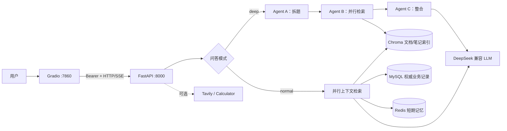

# AI 知识库问答系统

一个面向个人知识管理的 RAG + 多 Agent 问答项目。系统支持上传文档、普通流式问答和深度研究，并围绕数据一致性、单用户安全边界、失败恢复、低敏感可观测性和可复现实验补齐了工程化证据。

> 项目定位：本地或可信内网中的单用户演示系统，不是完整多租户 SaaS，也不应未经额外保护直接暴露到公网。

## 项目亮点

- **双模式问答**：normal 模式并行检索四类上下文；deep 模式通过 LangGraph 完成拆题、并行检索和结构化整合。
- **三层记忆**：Redis 短期记忆、MySQL 情景记忆、MySQL + Chroma 语义记忆，明确区分权威数据与可重建索引。
- **一致性恢复**：Redis 冷恢复不会重复当前消息；LLM 中断只回滚当前 pending turn；完整回答提交后，辅助状态失败不会破坏问答记录。
- **安全边界**：业务 API 使用 Bearer token，后端固定单一 `APP_USER_ID`；上传有流式大小限制，文档删除失败保留可重试的权威记录。
- **可观测性**：request/turn ID 串联检索、首 token、完成和失败阶段；日志只记录 ID、计数、耗时、模式与错误类型。
- **可验证交付**：107 项自动化测试、真实本地 MySQL/Redis 联调、无密钥 GitHub Actions 和公开离线评测基线。

## 架构



### Chat 状态流

```text
Bearer 认证与资源归属校验
  -> 从 MySQL 恢复当前请求之前的 Redis 历史
  -> MySQL 持久化 user 消息并获得精确消息 ID
  -> Redis 追加消息、轮次和 TTL
  -> 并行检索上下文
  -> normal/deep 流式生成
  -> MySQL 持久化 assistant 消息
  -> best-effort 更新 Redis、摘要、事件和 last_active
  -> sources + done
```

生成未完成时按消息 ID 清理当前 turn；assistant 已持久化后，Redis 或情景记忆等派生步骤失败只记录降级事件，下一次请求可从 MySQL 恢复。

### 文档生命周期

上传按块读取并增量计算 SHA-256，超过 `MAX_UPLOAD_BYTES` 时在解析和 embedding 前返回 413。临时文件通过原子改名进入正式目录；解析、向量化或重复校验失败不会留下新数据库记录。删除时先处理 Chroma 派生索引，失败则保留 MySQL 权威记录与源文件以便重试。

## 技术栈

| 领域 | 技术 |
| --- | --- |
| API / UI | FastAPI、SSE、Gradio、httpx |
| LLM / Agent | DeepSeek 兼容 API、LangChain、LangGraph |
| RAG | ChromaDB、`BAAI/bge-small-zh-v1.5`、PyMuPDF、docx2txt |
| 数据 | MySQL、Redis、SQLAlchemy |
| 工程质量 | pytest、GitHub Actions、结构化事件日志、离线评测 CLI |

## 快速开始

### 1. 环境要求

- Python 3.11+
- MySQL 8.x
- Redis 6.x+

```bash
git clone <你的仓库地址>
cd ai-knowledge-qa
python -m venv venv

# Windows PowerShell
.\venv\Scripts\Activate.ps1
# Linux/macOS
# source venv/bin/activate

python -m pip install -r requirements.txt
```

### 2. 配置

复制 `.env.example` 为 `.env`，不要提交真实配置：

```bash
cp .env.example .env
```

| 变量 | 必填 | 用途 |
| --- | --- | --- |
| `DEEPSEEK_API_KEY` | 是 | LLM API 凭据 |
| `MYSQL_*` | 是 | MySQL 连接配置 |
| `APP_ACCESS_TOKEN` | 是 | Gradio 调用业务 API 的 Bearer token，应使用足够长的随机值 |
| `APP_USER_ID` | 是 | 服务端允许访问的固定单用户 ID |
| `REDIS_*` | 否 | Redis 连接配置，密码可留空 |
| `TAVILY_API_KEY` | 否 | 非空时允许 normal Agent 使用联网搜索 |
| `API_HOST` / `GRADIO_HOST` | 否 | 默认均为 `127.0.0.1` |
| `MAX_UPLOAD_BYTES` | 否 | 默认 25 MiB，是当前单机演示的可调整启发式值 |

可用以下命令生成 token：

```bash
python -c "import secrets; print(secrets.token_urlsafe(32))"
```

### 3. 初始化与启动

```powershell
python -m db.init_db

# Windows：双击 start.bat，或在终端执行
.\start.bat
```

`start.bat` 会优先使用项目的 `venv`，并行拉起前后端并等待后端健康检查通过；按 `Ctrl+C` 会一起关闭两个服务。若已有后端占用 8000 端口，启动器会明确报错，避免连接到错误配置的旧进程。跨平台环境可以直接运行同一启动器：

```bash
python launcher.py
```

也可以在两个终端中分别启动，便于单独调试：

```bash

# 终端一：后端
python -m app.main

# 终端二：前端
python -m frontend.app
```

访问 `http://127.0.0.1:7860`。健康检查位于 `http://127.0.0.1:8000/`，业务 API 位于 `/api/v1/*` 并要求 Bearer token。

## 验证与实测证据

### 自动化测试

```bash
python -m pytest -q
python -m pip check
python -m compileall -q app agents db evaluation frontend memory rag tools
```

2026-07-27 在 Python 3.11 本地环境的结果：

| 检查 | 实际结果 |
| --- | --- |
| pytest | 107 passed |
| 后端模块导入 | 优化前单次冷导入约 20.97 秒；惰性加载后，三次独立进程实测 1.515–1.548 秒 |
| Gradio 冷启动与首屏初始化 | 三次独立进程实测冷导入、界面构建和 `init_app` 合计 4.694–5.055 秒，其中首屏 API 初始化 1.473–1.586 秒；前后端启动阶段并行 |
| pip check | No broken requirements found |
| 本地服务联调 | 根路径 200；带正确 token 的空测试用户会话查询 200；Redis PING 成功 |
| 故障路径 | 覆盖 Redis miss、LLM 中断、超限上传、Chroma 删除失败、跨用户访问和摘要会话删除 |

单元与集成测试通过不等于浏览器视觉验收。正式演示前仍应在目标机器手动完成上传、normal/deep 问答、会话切换和删除流程。

### 无密钥 RAG 离线评测

```bash
python evaluation/run_eval.py --top-k 2 --output evaluation/results/local.json
```

已提交的实际结果见 [`evaluation/results/lexical_baseline.json`](evaluation/results/lexical_baseline.json)：

| 数据集 / 检索器 | 样本 | Recall@2 | 来源覆盖@2 | 引用完整性 |
| --- | ---: | ---: | ---: | ---: |
| `aiqa-public-mini-v1` / `deterministic-char-bigram-v1` | 4 文档 / 4 问题 | 1.00 | 1.00 | 1.00 |

指标定义：

- **Recall@K**：前 K 个结果至少命中一个期望来源的问题比例。
- **来源覆盖@K**：被前 K 个结果找回的期望来源数 / 全部期望来源数。
- **引用完整性**：固定参考答案中实际引用的期望来源数 / 全部期望来源数。

这些结果只验证公开合成小样本、指标实现与确定性轻量检索基线，**不代表生产数据分布**；默认评测器不是线上使用的 BGE embedding，引用完整性也不评估实时 LLM 生成质量。结果记录数据集 SHA-256、检索器版本、运行时间和逐题分数，便于复核而不是夸大模型效果。

### CI

`.github/workflows/test.yml` 在 push、pull request 和手动触发时执行依赖安装、`pip check`、源码编译、全量测试和离线评测。CI 使用明确的占位环境变量，不读取仓库 secret，也不调用 MySQL、Redis 或付费 LLM。

工作流采用官方 `actions/checkout@v6` 与 `actions/setup-python@v6`，核对日期为 2026-07-27。

## 可观测性与隐私

每个 HTTP 请求返回 `X-Request-ID`。Chat turn 使用独立 `turn_id`，主要事件包括：

- `request_completed`
- `turn_started`
- `turn_retrieval_completed`
- `turn_first_token`
- `turn_completed` / `turn_failed` / `turn_cancelled`
- `turn_stage_failed`（已完成回答的派生状态降级）

事件消息为 JSON，只允许记录关联 ID、route 模板、状态码、模式、阶段、计数、耗时和错误类型。日志辅助函数会拒绝 `content`、`question`、`prompt`、`token`、`authorization` 等敏感字段名；不要在其他日志中自行输出请求体或完整异常上游响应。

## 安全边界与已知限制

- Bearer token + 固定 `APP_USER_ID` 是单用户演示边界，不是注册、密码、角色、刷新 token 或完整多租户认证。
- Gradio 本身没有独立登录。即使业务 API 有 token，外部监听也只适用于可信局域网；公网部署前应增加 HTTPS、反向代理认证、限流和网络访问控制。
- 默认监听 `127.0.0.1`；不要直接暴露 FastAPI 的 8000 端口或 Gradio 的 7860 端口。
- Chroma 的用户隔离依赖 metadata filter，而不是物理分库；当前后端再通过固定用户 ID 限制访问。
- 系统未实现恶意文件扫描、复杂内容沙箱、全链路指标后端、告警、自动备份恢复演练或生产级容量验证。
- 25 MiB 上传上限来自当前单机演示约束，部署前应以真实文档的解析耗时、峰值内存和 embedding 成本重新校准。

## 适合简历的表述参考

> 设计并实现基于 FastAPI、LangGraph、Chroma、MySQL 与 Redis 的知识库问答系统，支持 normal/deep 双模式 SSE 流式回答；修复跨存储状态一致性与并行 Session 问题，引入 Bearer 单用户安全边界、流式上传限制和低敏感 turn 级可观测性，并以 107 项自动化测试、无密钥 CI 与可复现离线评测固化工程证据。

面试时建议重点解释三个取舍：为什么 MySQL 是权威数据源、为什么 Chroma/Redis 失败采用可恢复策略、为什么公开评测基线不能等同于线上模型质量。

## 项目结构

```text
agents/       LangGraph 深度研究工作流
app/          FastAPI 路由、认证、错误处理、SSE 与可观测性
db/           SQLAlchemy 模型、连接与建表脚本
evaluation/   公开数据集、无密钥评测 CLI 和实际结果
frontend/     Gradio 薄客户端
memory/       短期、情景和语义记忆
rag/          Loader、Splitter、Chroma、Retriever 与 LLM 封装
tests/        自动化测试
tools/        Web Search 与 Calculator 工具
```
